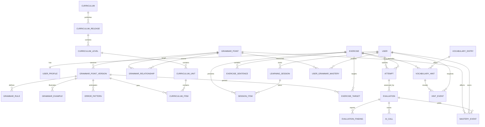

# Database and ERD Specification

## Database conventions

- PostgreSQL; `uuid` primary keys; `timestamptz` timestamps in UTC.
- Tables/columns use `snake_case`; application types may use `camelCase`.
- Every mutable table has `created_at`, `updated_at`; optimistic `version` where concurrent edits matter.
- Controlled enums SHOULD be lookup/check constrained when migrations need flexibility.
- `jsonb` is allowed for versioned snapshots, provider payload subsets, and extensible rule parameters—not for core relations that require joins or constraints.
- Foreign-key delete behavior is explicit. Learning evidence defaults to `RESTRICT`; user-owned PII uses controlled erasure/anonymization.

## Logical ERD

## Required tables

### Engagement expansion (phased)

- `story_series`, `story_chapters`, `story_scenes`, `story_choices`, `user_story_progress`, and `user_story_choices` store versioned narrative content and learner branch state.
- `unit_challenges` and `unit_challenge_targets` pin multi-target challenge contracts; presented challenges reuse immutable Practice exercise/attempt/evaluation evidence.
- `learner_error_patterns` is a rebuildable projection over findings with state/trend counters; historical attempts remain authoritative.
- `learner_interest_preferences` stores approved topic codes and priority.
- `achievement_definitions` and append-only `achievement_grants` store policy-versioned meaningful rewards.
- `meaningful_learning_days` stores idempotent day evidence and rest/grace metadata without deleting missed days.
- `weekly_progress_reports` stores structured fact snapshots plus optional AI-authored presentation text.
- `ai_provider_capabilities` and `ai_provider_health_events` store safe probe/health metadata only; provider keys are never database records.

Exact physical columns and constraints MUST be added through forward-only migrations in the owning implementation phase. Do not create all tables speculatively in E0.

### Identity

- `users(id, username, password_hash, status, created_at, updated_at, deleted_at)`; unique normalized `username`. Password hashes are produced only by the approved authentication library.
- `user_profiles(user_id, display_name, native_locale, target_locale, timezone, consent_version, preferences_json)`.

### Grammar KB

- `grammar_points(id, code, family_code, canonical_slug, status)`; unique stable `code` and slug.
- `grammar_point_versions(id, grammar_point_id, version_no, cefr_level, title, short_description, form_summary, meaning_summary, usage_notes, locale, status, published_at, content_hash)`; unique `(grammar_point_id, version_no, locale)`.
- `grammar_relationships(id, source_point_id, target_point_id, relationship_type, rationale, strength, status)`; unique relation tuple; no self-edge.
- `grammar_rules(id, grammar_point_version_id, rule_code, rule_type, description, pattern_json, priority)`.
- `grammar_examples(id, grammar_point_version_id, example_type, english_text, vietnamese_text, explanation, tags, sort_order)`.
- `error_patterns(id, grammar_point_version_id, error_code, incorrect_pattern, corrected_pattern, explanation_vi, detection_hint_json, severity)`.

### Curriculum

- `curricula(id, code, title, audience_json, status)`.
- `curriculum_releases(id, curriculum_id, version_no, status, published_at, content_hash)`.
- `curriculum_levels(id, release_id, code, cefr_level, title, sort_order, unlock_policy_json)`.
- `curriculum_units(id, level_id, code, title, sort_order)`.
- `curriculum_items(id, unit_id, grammar_point_version_id, role, sort_order, weight, minimum_evidence_count)`; unique placement per unit/version/role.
- `user_curriculum_enrollments(id, user_id, release_id, current_level_id, status, enrolled_at, completed_at)`.

### Practice and evaluation

- `learning_sessions(id, user_id, enrollment_id, session_type, status, plan_policy_version, started_at, completed_at, summary_json)`.
- `session_items(id, session_id, exercise_id, position, selection_reason, status, presented_at, completed_at)`; unique `(session_id, position)`.
- `exercises(id, origin, type, content_status, generator_version, evaluator_rubric_version, locale, difficulty, prompt_context_vi, instruction_vi, constraints_json, content_snapshot_json, created_at)`.
- `exercise_targets(exercise_id, grammar_point_version_id, target_role, weight)`.
- `exercise_sentences(id, exercise_id, position, source_text_vi, reference_answers_json, semantic_requirements_json)`.
- `attempts(id, exercise_id, session_item_id, user_id, attempt_no, answer_text, normalized_answer, status, idempotency_key, submitted_at, evaluated_at)`; unique `(user_id, idempotency_key)` and `(session_item_id, attempt_no)`.
- `evaluations(id, attempt_id, evaluator_version, rubric_version, disposition, target_used, meaning_preserved, overall_score, confidence, feedback_vi, corrected_answer, is_effective, supersedes_id, completed_at)`; partial unique effective evaluation per attempt.
- `evaluation_findings(id, evaluation_id, category, code, severity, message_vi, evidence_span_json, suggested_fix, grammar_point_id)`.
- `ai_calls(id, evaluation_id, purpose, provider, model, prompt_template_version, request_hash, response_schema_version, latency_ms, input_tokens, output_tokens, estimated_cost, status, provider_request_id, error_code, safe_metadata_json, created_at)`.

### Learning

- `mastery_events(id, user_id, grammar_point_id, attempt_id, evaluation_id, policy_version, evidence_type, evidence_weight, score_delta, reason_codes, idempotency_key, occurred_at)`; unique `idempotency_key`.
- `user_grammar_mastery(user_id, grammar_point_id, band, mastery_score, retention_score, confidence, evidence_count, independent_success_count, assisted_success_count, current_streak, last_practiced_at, next_review_at, last_event_id, projection_version)`; composite primary key.
- `level_progress(user_id, curriculum_level_id, status, progress_score, unlocked_at, completed_at, policy_version)`.

### Vocabulary and operations

- `vocabulary_entries(id, lemma, part_of_speech, sense_key, definition_vi, cefr_level, status)`.
- `vocabulary_hints(id, exercise_id, vocabulary_entry_id, surface_form, hint_level, hint_text_vi, position, is_answer_revealing)`.
- `hint_events(id, user_id, session_item_id, vocabulary_hint_id, hint_level, revealed_at)`.
- `prompt_templates(id, purpose, version, template_hash, status, created_at)`; actual sensitive/provider templates may live in versioned application assets.
- `outbox_events(id, aggregate_type, aggregate_id, event_type, payload_json, occurred_at, published_at, attempts)`.
- `audit_log(id, actor_type, actor_id, action, entity_type, entity_id, metadata_json, occurred_at)`.

## Essential indexes

- `grammar_points(code)`, published version lookup, relationship source/target/type.
- Curriculum ordered indexes on parent + `sort_order`.
- `attempts(user_id, submitted_at desc)`, `attempts(session_item_id, attempt_no)`.
- `user_grammar_mastery(user_id, next_review_at)` with due-review partial index.
- `mastery_events(user_id, grammar_point_id, occurred_at)`.
- `learning_sessions(user_id, started_at desc)` and active-session partial index.
- `outbox_events(published_at, occurred_at)` where unpublished.
- AI analytics on `(provider, model, created_at)` and `status`.

## Migration rules

- Never edit an applied migration; add a forward migration.
- Expand/migrate/contract for destructive schema changes.
- Seed reference data idempotently and separate demo data from production content.
- Every migration with data transformation includes verification and rollback/roll-forward notes.
- Content publication is not embedded in schema migrations after the initial bootstrap.
