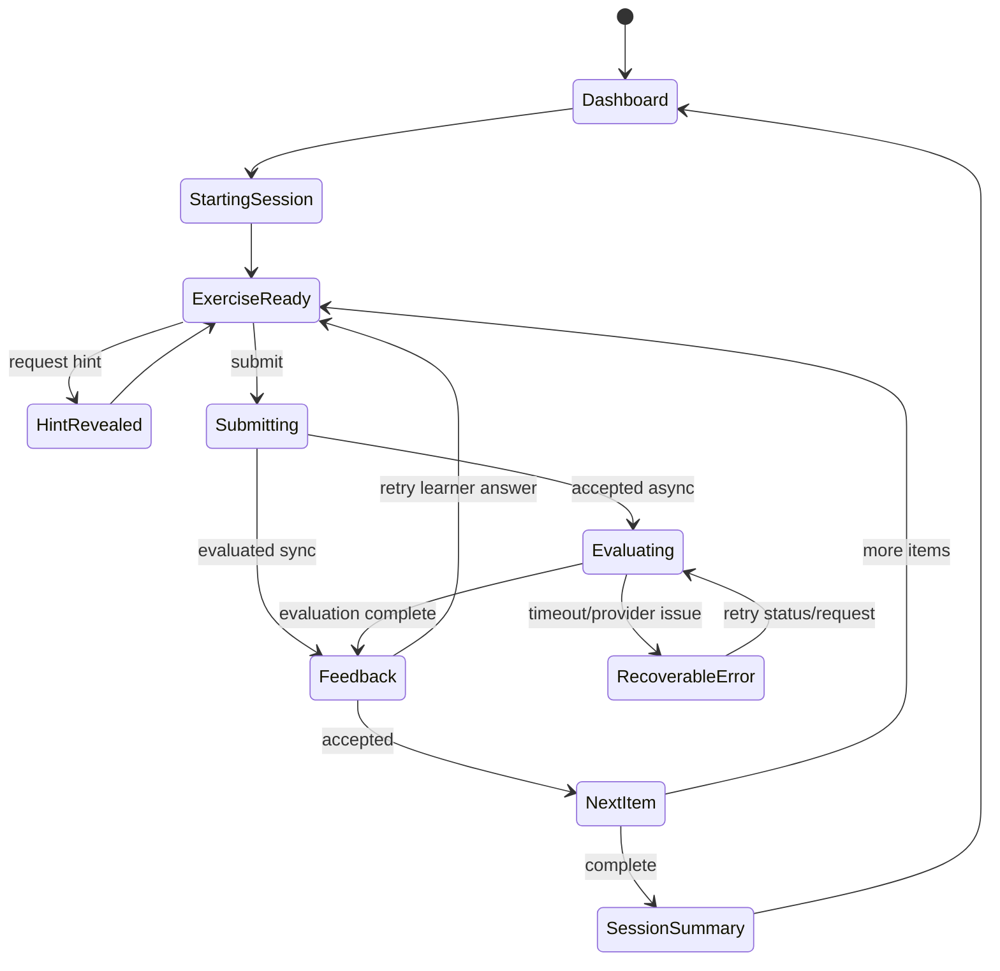

# Frontend State and Flow Contract

## State ownership

- API owns authentication, active enrollment/session, attempts, evaluations, hints, mastery, and progression.
- URL owns navigable identity (`sessionId`, curriculum route).
- Query cache owns disposable server snapshots.
- Local component state owns draft text and presentation only.
- Persist an unsent answer draft locally per session item; never treat it as submitted evidence.
- Do not duplicate mastery/progression logic in the browser.

## Learner flow

## Required UI states

Every server-backed screen has loading, empty, error, unauthorized, and stale/retry states. Attempt submission additionally handles:

- double-click/network retry through one idempotency key;
- evaluation pending across reloads;
- AI unavailable without blaming or penalizing the learner;
- accepted-with-feedback distinct from retry;
- session resumed on another device;
- exercise withdrawn/invalidated safely.

## Submission behavior

- Disable duplicate UI submissions while a request is pending, but rely on server idempotency for correctness.
- Preserve the learner's exact answer; show corrections separately.
- Clear draft only after server acknowledges submission.
- Poll with server-provided delay/backoff; stop on terminal status and when screen unmounts.
- Accessibility: keyboard submission must avoid accidental send, feedback is screen-reader announced, focus moves predictably, color is not the only signal.

## Feedback hierarchy

Show disposition, concise Vietnamese explanation, target-specific finding, other findings, correction/alternative, and next action—in that order. Internal confidence, model, scores, and reference-answer lists are not learner-facing by default.

## Grammar guidance

- Every exercise presents a visible, expandable grammar guide for each pinned target.
- The guide shows CEFR, Vietnamese learning objective, form patterns, meaning/uses, usage notes, hard/tendency rules, and reviewed bilingual examples supplied by the API.
- The frontend MUST NOT derive or hardcode grammar rules from target codes.
- Guidance may help the learner understand the target but MUST NOT reveal the exercise's complete reference answer.

## Home roadmap

- The authenticated home screen presents the complete A1-C2 path in curriculum order, not only the current-level summary.
- Each level node shows its status, progress, ordered units, and pinned learner-facing GrammarPoint titles supplied by `GET /me/progress`.
- The current node owns the primary start/resume action. Locked nodes explain future content but MUST NOT provide progression shortcuts.
- The frontend MUST NOT hardcode curriculum titles, grammar lists, unlock status, or progress calculations.

## Analytics events

Use semantic events without answer text/PII: `session_started`, `exercise_viewed`, `hint_revealed`, `attempt_submitted`, `evaluation_received`, `retry_started`, `exercise_accepted`, `session_completed`. Analytics failure never blocks learning.

## Engagement navigation

- Home adds three server-supplied daily choices without removing the A1-C2 roadmap.
- Mistake notebook, story journey, achievements, and weekly reflection are separate navigable views with loading/empty/error/retry states.
- Story text is skippable; the equivalent learning action remains accessible.
- Locked branches and levels explain requirements but cannot be unlocked client-side.
- Game feedback never hides evaluator feedback, correction, or the next learning action.
